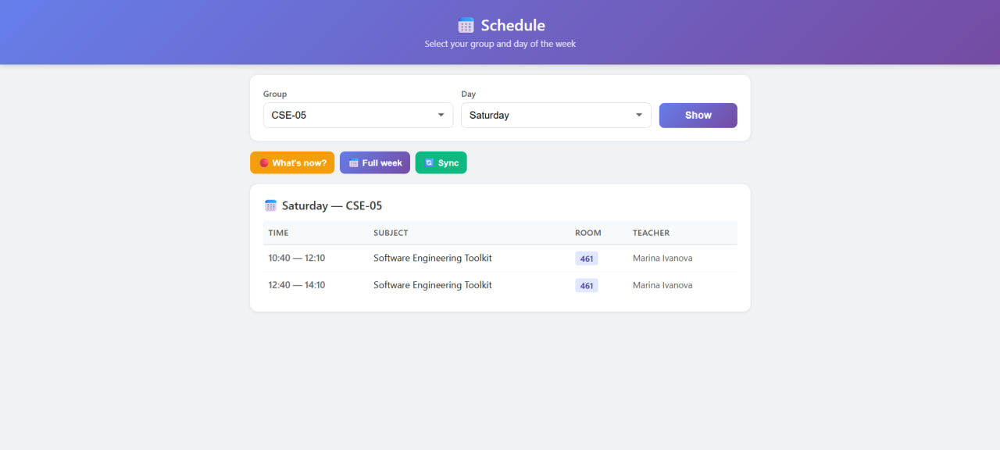
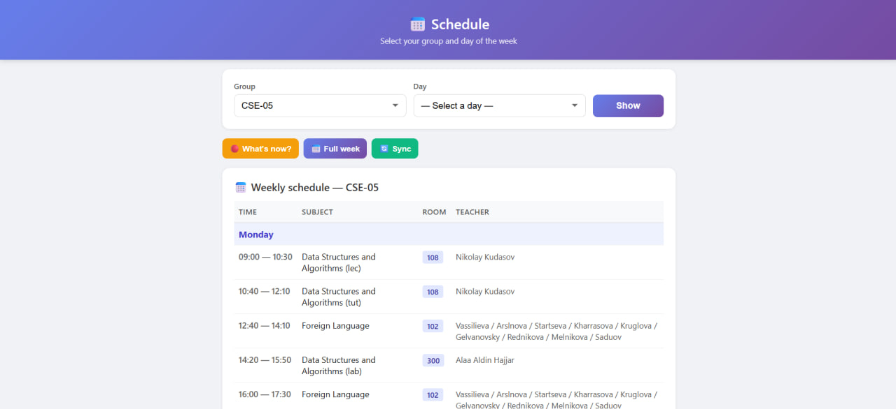
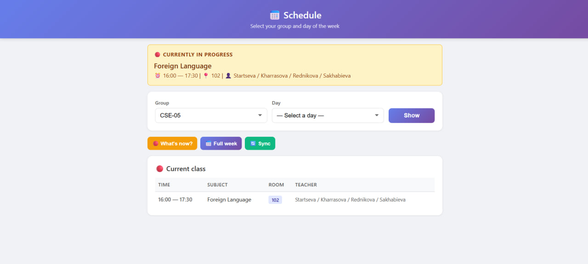

# Schedule Bot

Schedule assistant with a web UI and natural-language chatbot — answers questions about classes, rooms, and teachers, even when offline.

## Demo





## Context

### End Users

Students and staff at Sirius University who need quick access to class schedules.

### Problem

Timetables are stored in Google Sheets — inconvenient to navigate on mobile, no quick way to find a room or answer "what class do I have now?".

### Solution

A single interface that:
- Shows daily / weekly schedule in a mobile-friendly layout with one tap using web application

## Features

### Implemented

| Feature | Description |
|---------|-------------|
| **Day schedule** | Select group + day → see all lessons with time, room, teacher |
| **Week schedule** | Full Mon–Sat view with day headers |
| **"What's now?"** | Highlights the current lesson based on system time |
| **Auto-sync** | Fetches latest data from Google Sheets on startup |
| **Manual sync** | Refresh data via button |
| **Offline resilience** | Works with cached SQLite data when Sheets is unreachable |
| **Even/odd week support** | Handles alternating weekly schedules |
| **Multi-group** | Switch between groups (CSE, DSAI, etc.) |
| **Docker deployment** | One-command deploy via `docker compose up` |
| **Standalone web UI** | No LLM needed for schedule browsing |

### Not Yet Implemented

| Feature | Description |
|---------|-------------|
| **AI chatbot integration** | Nanobot agent with LLM that answers natural-language schedule questions via MCP tools — chat UI via nanobot-webchat |
| **Notifications** | Push reminders before next class |
| **Personal schedule** | Save favorite groups for quick access |

## Usage

### Web UI (no LLM required)

Open `http://<host>:8080` in any browser:
1. Select your group from the dropdown
2. Pick a day or press **"Full week"** for the full week
3. Press **"What's now?"** to see the current lesson
4. Press **"Sync"** to fetch the latest data from Google Sheets

## Deployment

### OS

Ubuntu 24.04 (compatible with university VM images)

### Prerequisites

- Docker & Docker Compose
- An OpenAI-compatible LLM API endpoint (for chatbot only — Ollama, vLLM, OpenAI, etc.)
- Google Sheet URL with public schedule (read-only)

### Step-by-Step

1. **Clone the repository:**
   ```sh
   git clone https://github.com/ZZInfaZV/schedule-bot.git
   cd schedule-bot
   ```

2. **Configure environment:**
   ```sh
   cp .env.example .env
   nano .env
   ```
   Edit the following:
   - `LLM_API_BASE` — your LLM endpoint (e.g. `http://localhost:11434/v1`)
   - `LLM_API_KEY` — API key (can be `unused` for local Ollama)
   - `SCHEDULE_SHEET_URL` — Google Sheets URL with the timetable

3. **Start all services:**
   ```sh
   docker compose up -d --build
   ```

4. **Access the services:**
   - Web UI (schedule viewer): `http://<host>:8080`
   - Web chat (AI bot): `http://<host>:8765`

### Manual (without Docker)

```sh
# Install dependencies
uv sync

# Set up environment
cp .env.example .env
# Edit .env

# Run MCP server
cd mcp/mcp_schedule
uv run python -m mcp_schedule

# Run nanobot agent
cd nanobot
uv run nanobot gateway
```

## Architecture

```
[Web UI :8080] ──┐
                 ├──→ [SQLite DB] ← sync ← [Google Sheets]
[Nanobot Chat :8765] → [LLM API] → [Schedule MCP Server] ──┘
```

| Component | Port | Description |
|-----------|------|-------------|
| **webapp** | 8080 | FastAPI standalone schedule viewer |
| **Schedule MCP** | — | 6 tools: `get_now`, `get_schedule`, `get_week`, `get_room`, `get_teacher`, `sync_schedule` |
| **SQLite** | — | Local cache (`data/schedule.db`) |

## Project Structure

```
schedule-bot/
├── mcp/mcp_schedule/              # MCP server (tools + DB + sync)
├── webapp/                        # Standalone FastAPI web viewer
├── nanobot/                       # AI agent config + Dockerfile
├── nanobot-webchat/               # WebSocket chat channel plugin
├── data/                          # SQLite database (gitignored)
├── docker-compose.yml
├── .env.example
└── pyproject.toml
```

## License

MIT — see [LICENSE](LICENSE) file.
